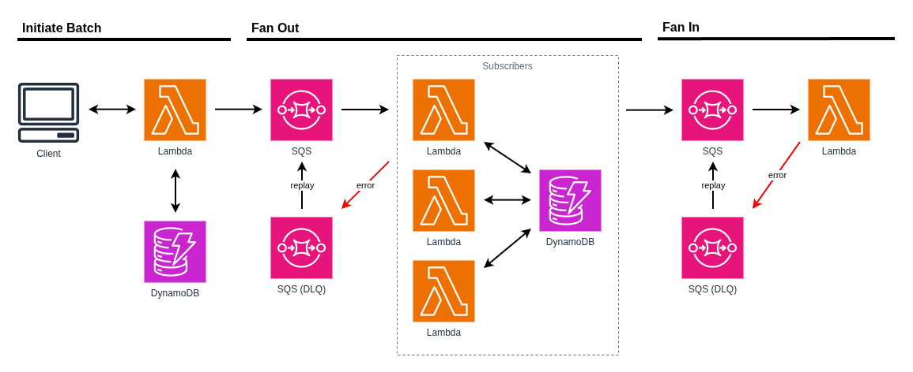

# Pattern: Fan Out / Fan In

This project provides a solid foundation for implementing Serverless Microservice Patterns with AWS Lambda functions using Node.js and TypeScript. The project uses the AWS CDK for infrastructure as code, Jest for testing, and modern development tooling.

## Fan Out / Fan In Pattern

There are many Serverless Microservice Patterns which may be implemented with AWS Lambda functions. This project illustrates the **"Fan Out / Fan In"** pattern. The Fan Out / Fan In pattern combines decomposition and aggregation: it breaks a large job into multiple smaller, independent tasks (fan out), processes them in parallel, and then aggregates the results (fan in). This is particularly useful for batch processing with progress tracking. Lambda functions are limited to 15 minutes of total execution time, and the Fan Out / Fan In pattern allows applications to overcome this limitation by decomposing work into smaller units while tracking completion status.



### Key Characteristics

The Fan Out / Fan In pattern is characterized by:

- **Task Decomposition (Fan Out)**: Breaking a single large workload into multiple smaller, independent tasks
- **Message Queue Decoupling**: Using message queues (SQS) to decouple producer functions from consumer functions
- **Progress Tracking**: Maintaining a record of the batch job with metrics (total records, processed count, unprocessed count)
- **Parallel Execution**: Multiple worker Lambda functions processing tasks concurrently from the message queue
- **Asynchronous Processing**: The initial upload function returns quickly after queuing work, rather than waiting for completion
- **Result Aggregation (Fan In)**: Collecting completion signals from worker functions and updating the overall job status

### When to Use

The Fan Out / Fan In pattern is ideal for scenarios such as:

- **Batch Processing with Progress Tracking**: Processing large CSV or batch files while monitoring progress and completion
- **Data Transformation**: Converting, validating, or enriching data across multiple records with completion reporting
- **Notification Delivery**: Sending notifications to thousands of users or devices with delivery tracking
- **Image Processing**: Resizing and optimizing images from a batch upload with progress monitoring
- **Report Generation**: Processing large datasets to generate reports with status tracking
- **ETL Operations**: Extract, transform, and load operations on large datasets with job completion notifications
- **Distributed Workloads**: Any parallelizable workload that requires progress tracking and completion aggregation

### Key Benefits

1. **Overcomes Time Limits**: Process jobs larger than the 15-minute Lambda execution limit
2. **Horizontal Scalability**: Add more worker functions to process work faster without architectural changes
3. **Progress Visibility**: Track the progress of batch jobs with processed and unprocessed record counts
4. **Completion Notification**: Know when all tasks are complete and trigger downstream processes
5. **Resilience**: Message queue retries ensure failed tasks are automatically reprocessed
6. **Cost Efficiency**: Pay only for execution time used; idle workers consume no resources
7. **Decoupling**: Producer and consumer functions are independent, enabling flexible scaling and failure handling
8. **Observable**: Monitor queue depth, worker performance, completion events, and failure rates independently
9. **Flexible Rate Control**: SQS allows you to control the rate of task processing through concurrency settings

## What's inside

This example demonstrates the Fan Out / Fan In pattern these microservices.

### Task Service

The **Task Service** is a complete microservice that provides task management functionality. It exposes functions to:

- Create new tasks
- Retrieve a specific task
- List all tasks
- Update existing tasks
- Delete tasks
- Upload a CSV file containing multiple tasks

The Task Service functions interact with a DynamoDB table to persist task data and uses an SQS queue to implement the fan-out pattern for batch task creation.

### The Fan Out / Fan In Pattern in Action

The fan-out / fan-in pattern is demonstrated when uploading a CSV file containing multiple task records:

1. **CSV Upload**: A user invokes the Upload CSV endpoint with a file containing multiple task records. The file is uploaded to an S3 bucket.

2. **Fan Out**: When a file is uploaded to S3, an S3 event notification triggers the Upload Task Subscriber Lambda via a message in the SQS Task Upload Queue. This subscriber reads the CSV file, creates a TaskFile record to track progress, and publishes a message to the SQS Create Task Queue for each row in the CSV file..

3. **Parallel Processing**: The Create Task Subscriber Lambda listens to the SQS Create Task Queue and processes messages in parallel, creating one task per message in the DynamoDB table. Each task subscriber also updates the TaskFile's progress metrics.

4. **Progress Tracking**: As tasks are created, the TaskFile record maintains counts of total records, processed records, and unprocessed records, providing visibility into batch job progress.

5. **Aggregation (Fan In)**: When all tasks are processed, the Create Task Subscriber publishes a `taskfile_processing_complete` event via SNS. The TaskFile Complete Queue, which is subscribed to this event, receives the completion notification.

6. **Completion Handling**: The Complete Task File Subscriber processes the completion event and updates the TaskFile status to `COMPLETED`, marking the batch job as finished.

This pattern allows the application to:

- Process large batch files without hitting Lambda execution time limits
- Track the progress of batch processing in real-time
- Scale horizontally by processing multiple tasks concurrently
- Handle failures gracefully through SQS message retention and retry mechanisms
- Notify downstream systems when batch processing is complete
- Decouple file upload, task creation, and completion handling for better system resilience

### Fan Out / Fan In Messaging Architecture

The infrastructure implements the Fan Out / Fan In pattern through coordinated messaging:

#### Fan Out Phase

1. **CSV Upload**: Files uploaded to S3 trigger `ObjectCreated` events
2. **Event Routing**: S3 notifications automatically publish events to the Task Upload Queue
3. **File Processing**: The Upload Task Subscriber Lambda reads the CSV file and:
   - Creates a TaskFile record with `NEW` status
   - Parses CSV rows and creates individual task creation messages
   - Publishes each row as a message to the Create Task Queue
   - Returns immediately (no waiting for task creation)

#### Parallel Processing Phase

4. **Message Decomposition**: Each CSV row becomes an independent SQS message in the Create Task Queue
5. **Worker Concurrency**: Multiple Create Task Subscriber Lambdas process messages in parallel:
   - Batch size: 10 messages per invocation
   - Max concurrency: 5 concurrent Lambdas
   - Each processes one task creation message
6. **Progress Tracking**: As tasks are created, the TaskFile record is updated with:
   - `processedCount`: Number of successfully created tasks
   - `unprocessedCount`: Number of remaining tasks
   - Status remains `IN_PROGRESS`

#### Fan In Phase (Aggregation)

7. **Completion Signaling**: When all tasks are processed, the Create Task Subscriber publishes a `taskfile_processing_complete` event to the Task SNS Topic
8. **Event Filtering**: The TaskFile Complete Queue has a subscription filter that captures only `taskfile_processing_complete` events
9. **Completion Handler**: The Complete TaskFile Subscriber Lambda:
   - Processes the aggregated completion event
   - Updates the TaskFile record status to `COMPLETED`
   - Marks the batch processing as finished

#### Message Flow Diagram

```
S3 Upload → S3 Events → Task Upload Queue → Upload Task Subscriber
                                                    ↓
                                        Create TaskFile (NEW)
                                        Parse CSV & Fan Out
                                                    ↓
                                        Create Task Queue
                                                    ↓
              ┌─────────────────┬──────────────┬──────────────┐
              ↓                 ↓              ↓              ↓
        Create Task          Create Task    Create Task    Create Task
        Subscriber 1         Subscriber 2   Subscriber 3   Subscriber 4
        (Create Task)        (Create Task)  (Create Task)  (Create Task)
              │                 │              │              │
              └─────────────────┴──────────────┴──────────────┘
                                        ↓
                        Update TaskFile (IN_PROGRESS)
                        Publish Completion Event
                                        ↓
                            Task SNS Topic
                                        ↓
                    TaskFile Complete Queue
                    (Event filtering applied)
                                        ↓
                    Complete TaskFile Subscriber
                    (Aggregation)
                                        ↓
                    Update TaskFile (COMPLETED)
```

## Getting started

### Deploy the Task Service

Follow the instructions in the [Task Service documentation](./task-service/README.md) to deploy the Task Service to AWS.

### Using the application

#### Testing the Fan Out Pattern

To test the fan-out pattern implementation, follow these steps:

1. **Deploy the Task Service** using the instructions above.

2. **Prepare a CSV File**
   - Use the [sample.csv](./sample.csv) file included in this project as a template
   - Or create your own CSV file with the following columns:
     - `title` (required): Task title
     - `detail` (optional): Task description or details
     - `dueAt` (optional): Due date in ISO 8601 format (e.g., `2026-01-01T00:00:00.000Z`)
     - `isComplete` (optional): Boolean indicating if task is complete (default: `false`)

3. **Invoke the Upload CSV API**
   - Using an API client like Postman or curl, upload your CSV file to the Upload CSV Lambda function endpoint
   - The function will parse the CSV, fan out each record as an SQS message, and return immediately

4. **Monitor Task Creation**
   - The Create Task Subscriber Lambda function will process messages from the SQS queue asynchronously
   - Monitor the SQS queue to watch tasks being processed
   - Query the Task Service's list tasks endpoint to verify tasks have been created in DynamoDB

#### API Endpoints

The Task Service provides the following REST API endpoints:

- `POST /tasks` - Create a single task
- `GET /tasks` - List all tasks
- `GET /tasks/{id}` - Get a specific task
- `PUT /tasks/{id}` - Update a task
- `DELETE /tasks/{id}` - Delete a task
- `POST /tasks/upload` - Upload a CSV file to S3 (triggers fan-out / fan-in pattern)

When you POST a CSV file to `/tasks/upload`, the system automatically:

1. Stores the file in S3
2. Creates a TaskFile record to track batch progress
3. Parses the CSV and enqueues each row as a separate message
4. Processes messages in parallel across multiple workers
5. Updates progress metrics as tasks are created
6. Publishes a completion event when all tasks are processed
7. Updates the TaskFile status to mark the batch as complete

## Further Reading

- [Task Service Documentation](./task-service/README.md)
- [Back to all Serverless Microservice Patterns](../../README.md)
