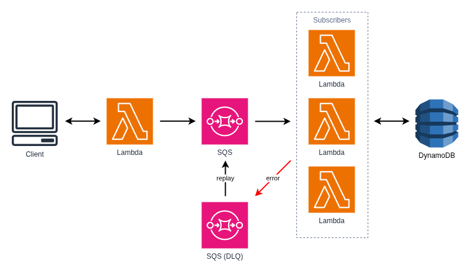

# Pattern: Fan Out

This project provides a solid foundation for implementing Serverless Microservice Patterns with AWS Lambda functions using Node.js and TypeScript. The project uses the AWS CDK for infrastructure as code, Jest for testing, and modern development tooling.

There are many Serverless Microservice Patterns which may be implemented with AWS Lambda functions. This project illustrates the "Fan Out" pattern. The Fan Out pattern breaks a large job into a collection of smaller jobs. This is particularly useful for batch processing. Lambda functions are limited to 15 minutes of total execution time and the Fan Out pattern allows applications to overcome this limitation by decomposing work into smaller units.

## What's inside

This example demonstrates the Fan Out pattern these microservices.

### Task Service

> TODO: Review and rewrite

The **Task Service** is a complete microservice that provides task management functionality. This service is shared across multiple patterns and is the same Task Service used in the "Simple Web Service" pattern. It exposes functions to:

- Create new tasks
- Retrieve a specific task
- List all tasks
- Update existing tasks
- Delete tasks

The Task Service functions interact with a DynamoDB table to persist task data.

### The Fan Out Pattern in Action

> TODO: Rewrite

The key demonstration of the Internal API pattern occurs in the Daily Planner service. When the Daily Planner Lambda function executes, it makes a direct, synchronous call to the List Tasks Lambda function from the Task Service. This Lambda-to-Lambda invocation is the core of the Internal API pattern and showcases how one microservice can depend on another microservice by directly invoking its Lambda functions.

This pattern allows the Daily Planner service to retrieve task data without duplicating the Task Service's logic, maintaining the principle of single responsibility while demonstrating service-to-service communication within a serverless architecture.

## Getting started

### Deploy the Task Service

Follow the instructions in the [Task Service documentation](./task-service/README.md) to deploy the Task Service to AWS.

### Using the application

> TODO: Rewrite

Using an API client such as Postman, interact with the Task Service API endpoints. Create one or more tasks that may be fetched by the Planner Service.

Next, invoke the daily planner API endpoint. The planner service will invoke the _list tasks_ function and return those tasks in the API response.

## Further Reading

- [Task Service Documentation](./task-service/README.md)
- [Back to all Serverless Microservice Patterns](../../README.md)
