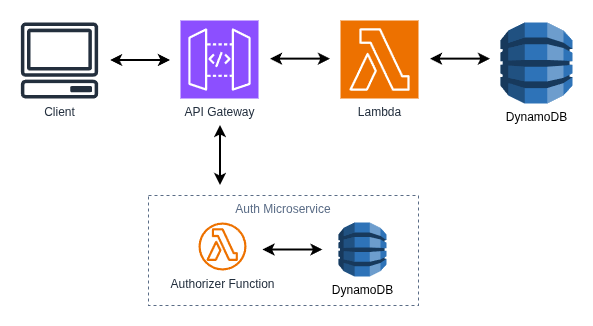

# Pattern: The Gatekeeper

This project provides a solid foundation for implementing Serverless Microservice Patterns with AWS Lambda functions using Node.js and TypeScript. The project uses the AWS CDK for infrastructure as code, Jest for testing, and modern development tooling.

## Gatekeeper Pattern

There are many Serverless Microservice Patterns which may be implemented with AWS Lambda functions. This project illustrates the "Gatekeeper" pattern. The Gatekeeper builds on the "Simple Web Service", adding a centralized authorization layer that protects multiple backend microservices. Using an API Gateway Token Authorizer, all incoming requests are validated before they reach protected resources, ensuring that only authenticated and authorized requests proceed.

### Key Characteristics

The Gatekeeper pattern is characterized by:

- **Centralized Authorization Layer**: A single Auth Service validates all requests before they reach backend services
- **Token-Based Authentication**: Requests are authenticated using tokens (e.g., JWTs, API keys, bearer tokens) provided in request headers
- **API Gateway Token Authorizer**: API Gateway intercepts and delegates authorization decisions to a Lambda-based authorizer function
- **IAM Policy Generation**: The authorizer generates AWS IAM policies to allow or deny access to protected resources
- **Request Interception**: All requests are intercepted and validated before reaching the backend services
- **Context Propagation**: Validated user information is passed to downstream services for request processing

### When to Use

The Gatekeeper pattern is ideal for scenarios such as:

- **Multi-Service Protection**: Protecting multiple backend services with a single authorization layer
- **Token-Based APIs**: APIs that use bearer tokens, JWTs, or other token-based authentication schemes
- **Third-Party Integration**: Validating tokens from external identity providers (e.g., Cognito, Auth0, Identity Platform)
- **Role-Based Access Control**: Implementing authorization rules based on user roles or claims
- **Legacy Service Protection**: Adding authorization to existing services without modifying their code
- **Compliance Requirements**: Meeting security and audit requirements for regulated industries
- **API Rate Limiting**: Implementing per-user or per-token rate limiting at the API Gateway level

### Key Benefits

1. **Centralized Security**: Single location to implement and maintain authorization logic
2. **Consistent Protection**: All requests go through the same authorization checks regardless of backend service
3. **Reduced Duplication**: Eliminates the need to implement authorization logic in every backend service
4. **Easy Maintenance**: Update authorization rules in one place; changes apply to all protected services
5. **Performance**: Authorization decisions cached by API Gateway reduce repeated evaluations
6. **Audit Trail**: Centralized logging provides complete visibility into authorization decisions
7. **Fine-Grained Control**: Granular authorization rules based on tokens, scopes, and custom claims

## What's inside

### Task Service

The **Task Service** is a complete microservice that provides task management functionality. This service is shared across multiple patterns and is the same Task Service used in the "Simple Web Service" pattern. It exposes functions to:

- Create new tasks
- Retrieve a specific task
- List all tasks
- Update existing tasks
- Delete tasks

The Task Service functions interact with a DynamoDB table to persist task data.

### Auth Service

The **Auth Service** is a specialized microservice that secures access to the Task Service API using token-based authorization. This service implements an API Gateway Token Authorizer that validates incoming requests before they reach the Task Service. It provides:

- **Token Validation** - Validates authorization tokens from API requests
- **Token-Based Authorization** - Implements a custom token validation logic to authenticate requests
- **IAM Policy Generation** - Generates AWS IAM policies to allow or deny access to protected resources
- **Context Passing** - Passes validated user context to downstream services for per-request authorization decisions

The Auth Service leverages AWS API Gateway's token authorizer capability to act as a gatekeeper, allowing only authenticated requests to reach the Task Service endpoints.

### The Gatekeeper Pattern in Action

The key demonstration of the Gatekeeper pattern occurs when an API request is made to the Task Service. Before the request reaches the Task Service Lambda functions, API Gateway invokes the Auth Service's Token Authorizer. The authorizer validates the authorization token provided in the request header and generates an IAM policy. If the token is valid, the policy allows access to the Task Service resources. If the token is invalid, the policy denies access and the request is rejected.

This pattern ensures that all requests to protected resources are authenticated before they reach the backend services, providing a centralized security layer across your microservice architecture while maintaining the single responsibility principle of each service.

## Getting started

### Deploy the Auth Service

Follow the instructions in the [Auth documentation](./auth-service/README.md) to deploy the Auth Service to AWS.

### Deploy the Task Service

Follow the instructions in the [Task Service documentation](./task-service/README.md) to deploy the Task Service to AWS.

### Using the application

Using an API client such as Postman, interact with the Task Service API endpoints. Include a valid authorization token in the `Authorization` header of each request. Requests without a valid token will be denied by the Auth Service Token Authorizer.

For this demonstration, the a "valid" token is any value supplied in _Bearer token_ format in the `Authorization` header. For example, `Authorization: Bearer this-is-my-token`. If you would like to see the API Gateway deny a request, you may omit the token such as `Authorization: Bearer` or you may omit the `Authorization` header altogether.

In a real application, your Auth Service would integrate with an auth provider such as AWS Cognito or it would verify and decode JSON Web Tokens (JWTs).

## Further Reading

- [Task Service Documentation](./task-service/README.md)
- [Auth Service Documentation](./auth-service//README.md)
- [Back to all Serverless Microservice Patterns](../../README.md)
