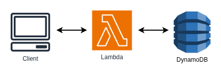

# Pattern: The Internal API

This project provides a solid foundation for implementing Serverless Microservice Patterns with AWS Lambda functions using Node.js and TypeScript. The project uses the AWS CDK for infrastructure as code, Jest for testing, and modern development tooling.

There are many Serverless Microservice Patterns which may be implemented with AWS Lambda functions. This project illustrates the "Internal API" pattern. The Internal API is basically the same as the "Simple Web Service", but there is no API Gateway to expose the service to the Internet. The "Internal API" is one or more Lambda functions which, together, comprise a serverless microservice. The Lambda functions are invoked synchronously via the AWS SDK via Lambda-to-Lambda invocations using an `InvocationType` of `RequestResponse`.

Some may say that calling a Lambda function from a Lambda function is an anti-pattern, but I do not share that opinion. There are many valid scenarios where one microservice needs to call another microservice asynchronously. One of the _core principles of microservices_ is **single responsibility** or **high cohesion**. This means that a microservice has one responsibility, it does one thing and does it well. Therefore it makes perfect sense that one Lambda microservice may need to synchronously call another Lambda microservice, especially when each has a specific purpose.

That said, implement this pattern carefully and on an as-needed basis. It is important to remember that the calling service will block and wait for the called service to return. This increases the exeuction time of the calling service and therefore the cost. Consider if an event-driven, asynchronous pattern is a better fit for the use-case.



## What's inside

This example demonstrates the Internal API pattern with two microservices:

### Task Service

The **Task Service** is a complete microservice that provides task management functionality. This service is shared across multiple patterns and is the same Task Service used in the "Simple Web Service" pattern. It exposes functions to:

- Create new tasks
- Retrieve a specific task
- List all tasks
- Update existing tasks
- Delete tasks

The Task Service functions interact with a DynamoDB table to persist task data.

### Daily Planner Service

The **Daily Planner Service** is a specialized microservice that provides daily planning functionality. It demonstrates the Internal API pattern by synchronously invoking the Task Service's **List Tasks** function using the AWS SDK with an `InvocationType` of `RequestResponse`.

#### The Internal API Pattern in Action

The key demonstration of the Internal API pattern occurs in the Daily Planner service. When the Daily Planner Lambda function executes, it makes a direct, synchronous call to the List Tasks Lambda function from the Task Service. This Lambda-to-Lambda invocation is the core of the Internal API pattern and showcases how one microservice can depend on another microservice by directly invoking its Lambda functions.

This pattern allows the Daily Planner service to retrieve task data without duplicating the Task Service's logic, maintaining the principle of single responsibility while demonstrating service-to-service communication within a serverless architecture.

## Getting started

### Prerequisites

Before you begin, ensure you have the following installed:

- **[Node Version Manager (NVM)](https://github.com/nvm-sh/nvm)** - Manages Node.js versions
- **Node.js** - JavaScript runtime (install via NVM)
- **npm** - Package manager (comes with Node.js)
- **AWS CLI** - For AWS credentials and configuration (recommended)

#### Setting up Node.js with NVM

This project uses the Node.js version specified in `.nvmrc`. See the [official nvm guide](https://github.com/nvm-sh/nvm) for additional information.

```bash
# Install NVM (if not already installed)
curl -o- https://raw.githubusercontent.com/nvm-sh/nvm/v0.40.3/install.sh | bash

# Install and use the correct Node.js version
nvm install
nvm use

# Verify installation
node --version  # Should output same version as in .nvmrc
```

#### Installing Dependencies

```bash
# Install project dependencies
npm install
```

## Project structure

This is a high-level overview of the project structure. This structure separates the infrastructure as code from the Lambda application code. Within the Lambda microservice component, directories provide structure to implement DRY (Don't Repeat Yourself) code which follows the SRP (Single Responsibility Principle).

```
/docs                           # Project documentation

/infrastructure                 # AWS CDK infrastructure code
  /stacks                       # CDK stack definitions
  /utils                        # CDK utilities and helpers
  app.ts                        # CDK app entry point
  cdk.json                      # CDK configuration
  jest.config.ts                # Infrastructure Jest configuration
  package.json                  # Infrastructure dependencies and scripts
  tsconfig.json                 # Infrastructure TypeScript configuration
  .env.example                  # Infrastructure example .env

/src                            # Application source code
  /handlers                     # Lambda function handlers
  /models                       # Data models and types
  /services                     # Business logic services
  /utils                        # Utility functions and helpers

eslint.config.mjs               # ESLint configuration
jest.config.ts                  # Jest testing configuration
package.json                    # Project dependencies and scripts
tsconfig.json                   # TypeScript configuration
.nvmrc                          # Node.js version specification
.prettierrc                     # Prettier formatting configuration
.editorconfig                   # Editor configuration
```

## How to use

### Commands and scripts

#### Development Commands

```bash
# Build TypeScript to JavaScript
npm run build

# Clean generated files and directories
npm run clean
```

#### Code Quality Commands

```bash
# Format code with Prettier
npm run format

# Check code formatting without making changes
npm run format:check

# Lint code with ESLint
npm run lint

# Lint and auto-fix issues
npm run lint:fix
```

#### Testing Commands

```bash
# Run tests without coverage
npm test

# Run tests with coverage report
npm run test:coverage

# Run tests in watch mode (reruns on file changes)
npm run test:watch
```

## Technology Stack

- **Language:** TypeScript
- **Platform:** AWS Lambda
- **Runtime:** Node.js 24+ (see .nvmrc)
- **Package Manager:** npm
- **AWS SDK:** v3
- **Testing:** Jest
- **Linting/Formatting:** ESLint + Prettier
- **Validation:** Zod
- **Logging:** Pino + Pino Lambda
- **Infrastructure:** AWS CDK
- **DevOps:** GitHub Actions

## Key Dependencies

### Runtime Dependencies

- **[@aws-sdk/client-dynamodb](https://www.npmjs.com/package/@aws-sdk/client-dynamodb)** - AWS SDK v3 DynamoDB client
- **[@aws-sdk/lib-dynamodb](https://www.npmjs.com/package/@aws-sdk/lib-dynamodb)** - DynamoDB document client utilities
- **[zod](https://www.npmjs.com/package/zod)** - TypeScript-first schema validation
- **[pino](https://getpino.io/)** - Low overhead, fast logger for JavaScript

### Development Dependencies

- **[@types/aws-lambda](https://www.npmjs.com/package/@types/aws-lambda)** - TypeScript definitions for AWS Lambda
- **[jest](https://www.npmjs.com/package/jest)** - Testing framework
- **[eslint](https://www.npmjs.com/package/eslint)** - Linting utility
- **[prettier](https://www.npmjs.com/package/prettier)** - Code formatter

## Environments

The project supports multiple environments:

- **dev** - Development environment
- **qat** - Quality Assurance/Testing environment
- **prd** - Production environment

Each environment has its own AWS account and configuration.

## Further Reading

- [Project Documentation](./docs/README.md)
