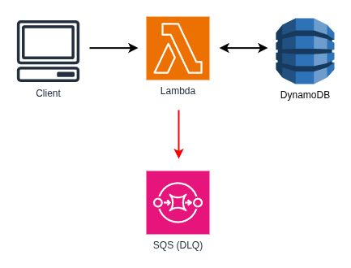

# Pattern: The Internal Handoff

This project provides a solid foundation for implementing Serverless Microservice Patterns with AWS Lambda functions using Node.js and TypeScript. The project uses the AWS CDK for infrastructure as code, Jest for testing, and modern development tooling.

There are many Serverless Microservice Patterns which may be implemented with AWS Lambda functions. This project illustrates the "Internal Handoff" pattern. The Internal Handoff is similar to the Internal API, however the calling service invokes the called microservice _asynchronously_ rather than synchronously. The Lambda functions are invoked asynchronously via the AWS SDK via Lambda-to-Lambda invocations using an `InvocationType` of `Event`.

An asynchronously invoked Lambda function will automatically retry failed invocations. Ensure the function's logic is idempotent and can handle the same event delivered multiple times. Attach a SQS Queue, a dead letter queue, to the Lambda function to capture failed events so that they may be replayed later.

Some may say that calling a Lambda function from a Lambda function is an anti-pattern, but I do not share that opinion. There are many valid scenarios where one microservice needs to call another microservice. One of the _core principles of microservices_ is **single responsibility** or **high cohesion**. This means that a microservice has _one_ responsibility, _one_ business or functional domain. It does one thing and does it well. Therefore it makes perfect sense that one Lambda microservice may need to synchronously call another Lambda microservice, especially when each has a specific purpose.

That said, implement this pattern carefully and on an as-needed basis. Consider if a different pattern is a better fit for the use-case such as "Notifier" or "Distributed Trigger".

## What's inside

This example demonstrates the Internal Handoff pattern with two microservices:

### Task Service

The **Task Service** is a complete microservice that provides task management functionality. This service is shared across multiple patterns and is the same Task Service used in the "Simple Web Service" pattern. It exposes functions to:

- Create new tasks
- Retrieve a specific task
- List all tasks
- Update existing tasks
- Delete tasks

The Task Service functions interact with a DynamoDB table to persist task data.

### Notification Service

TBD

### The Internal Handoff Pattern in Action

TBD

## Getting started

### Deploy the Task Service

Follow the instructions in the [Task Service documentation](./task-service/README.md) to deploy the Task Service to AWS.

### Deploy the Notification Service

Follow the instructions in the [Notification Service documentation](./notification-service/README.md) to deploy the Notification Service to AWS.

### Using the application

TBD

## Further Reading

- [Task Service Documentation](./task-service/README.md)
- [Notification Service Documentation](./notification-service//README.md)
- [Back to all Serverless Microservice Patterns](../../README.md)
