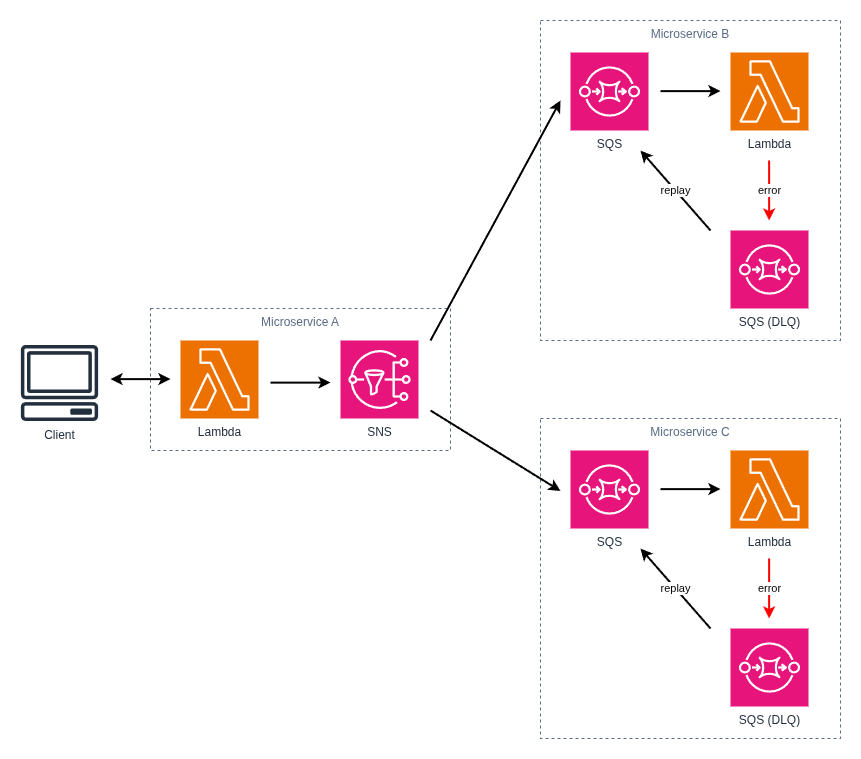

# Pattern: Publish Subscribe (Pub/Sub)

This project provides a solid foundation for implementing Serverless Microservice Patterns with AWS Lambda functions using Node.js and TypeScript. The project uses the AWS CDK for infrastructure as code, Jest for testing, and modern development tooling.

There are many Serverless Microservice Patterns which may be implemented with AWS Lambda functions. This project illustrates the "Publish Subscribe" pattern, also known as Pub/Sub. The Pub/Sub pattern is similar to the Notifier where the first service _publishes_ events to a SNS topic. Any number of services may _subscribe_ to the topic so that they may take action when those events occur.

To prevent losing events when unforseen issues occur and to manage the volume of incoming events, services subscribe to SNS topics with their own SQS queues rather than directly from the Lambda functions. When repeated failures occur, services place messages in a Dead Letter Queue, DLQ, for review and replay. Ensure the subscribing functions' logic are idempotent and can process the same event delivered multiple times.

The Publish Subscribe pattern is one of the essential patterns in an event-driven architecture. It promotes **loose coupling** between services. Services do not need to know the implementation details of other services, only the format of published events.



## What's inside

This example demonstrates the Publish Subscribe pattern with two microservices:

### Task Service

The **Task Service** is a complete microservice that provides task management functionality. This service is shared across multiple patterns and is the same Task Service used in the "Simple Web Service" pattern. It exposes functions to:

- Create new tasks
- Retrieve a specific task
- List all tasks
- Update existing tasks
- Delete tasks

The Task Service functions interact with a DynamoDB table to persist task data.

### Notification Service

The **Notification Service** is a dedicated microservice responsible for sending notifications. This service follows the single responsibility principle by focusing exclusively on notification delivery. It exposes a single function to:

- Send notifications (email, SMS, push notifications, etc.)

The Notification Service is designed to be invoked asynchronously by other microservices. It receives notification requests, processes them, and handles delivery to external notification providers. By separating notification logic into its own microservice, the application achieves better modularity, independent scalability, and easier testing and maintenance.

In this pattern, the Task Service invokes the Notification Service asynchronously when certain task events occur, such as task creation or completion. This decouples task management logic from notification delivery, allowing each service to evolve independently.

### The Publish Subscribe Pattern in Action

The Publish Subscribe pattern demonstrates how microservices can coordinate through asynchronous Lambda-to-Lambda invocations:

1. **Task Creation**: A client creates a new task via the Task Service's `create-task` function.

2. **Service Handoff**: After successfully creating the task in DynamoDB, the Task Service asynchronously invokes the Notification Service using the AWS SDK with `InvocationType: 'Event'`.

3. **Asynchronous Notification**: The Notification Service receives the handoff event and sends a notification (e.g., "New task created") without blocking the Task Service's response.

4. **Resilience**: If the Notification Service fails, AWS Lambda automatically retries the invocation (based on configured retry policy). Failed invocations that exhaust retries are sent to a Dead Letter Queue (SQS) for later analysis and replay.

**Key Benefits of This Pattern:**

- **Decoupling**: Services remain independent; the Task Service doesn't wait for notification delivery.
- **Performance**: The Task Service responds to clients immediately without waiting for notification processing.
- **Scalability**: Each service scales independently based on its specific workload.
- **Resilience**: Built-in retry mechanism and Dead Letter Queue ensure no notifications are lost.
- **Single Responsibility**: Each microservice has one well-defined purpose.

## Getting started

### Deploy the Notification Service

Follow the instructions in the [Notification Service documentation](./notification-service/README.md) to deploy the Notification Service to AWS.

### Deploy the Task Service

Follow the instructions in the [Task Service documentation](./task-service/README.md) to deploy the Task Service to AWS.

### Using the application

Once both services are deployed, you can interact with the application through the Task Service's API endpoints:

#### Create a Task

Send a POST request to the Task Service's `create-task` endpoint:

```bash
curl -X POST https://{api-gateway-url}/tasks \
  -H "Content-Type: application/json" \
  -d '{
    "title": "Implement feature X"
  }'
```

The Task Service will:

1. Validate and store the task in DynamoDB
2. Return a success response to the client immediately
3. Asynchronously invoke the Notification Service to send a "task created" notification

#### Retrieve a Task

```bash
curl https://{api-gateway-url}/tasks/{taskId}
```

#### List All Tasks

```bash
curl https://{api-gateway-url}/tasks
```

#### Update a Task

```bash
curl -X PUT https://{api-gateway-url}/tasks/{taskId} \
  -H "Content-Type: application/json" \
  -d '{
    "title": "Updated title",
    "status": "completed"
  }'
```

#### Delete a Task

```bash
curl -X DELETE https://{api-gateway-url}/tasks/{taskId}
```

**Monitoring and Troubleshooting:**

- Check CloudWatch Logs for both services to verify execution.
- Inspect the SQS Dead Letter Queue to identify and replay failed notification requests.
- Monitor Lambda metrics (duration, errors, throttling) in CloudWatch to optimize performance.
- Review X-Ray service maps to visualize the interaction between services.

## Further Reading

- [Task Service Documentation](./task-service/README.md)
- [Notification Service Documentation](./notification-service//README.md)
- [Back to all Serverless Microservice Patterns](../../README.md)
