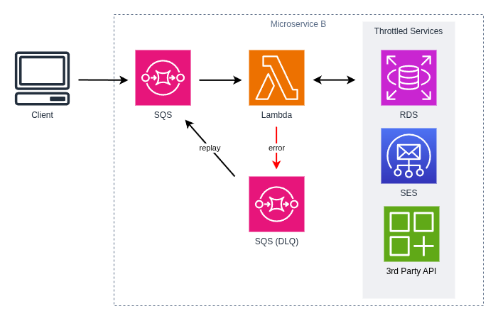

# Pattern: Queue-Based Load Leveling

This project provides a solid foundation for implementing Serverless Microservice Patterns with AWS Lambda functions using Node.js and TypeScript. The project uses the AWS CDK for infrastructure as code, Jest for testing, and modern development tooling.

## Queue-Based Load Leveling Pattern

The **Queue-Based Load Leveling** pattern uses a message queue as a buffer to decouple producers from consumers, smoothing out spikes in demand by allowing services to process messages at a steady, manageable rate. This prevents service overload, increases availability, and improves scalability by handling bursts of requests asynchronously without overwhelming the downstream system.

In this pattern:

- **Producers** (the Task Service) generate tasks and send them as messages to an SQS queue
- **Message Queue** (SQS) holds messages temporarily, acting as a buffer that decouples producers from consumers
- **Consumers** (the Notification Service) pull messages from the queue and process them at their own pace, independently of the incoming request rate

This pattern is ideal for unpredictable, bursty workloads where immediate, synchronous responses are not critical. It enables asynchronous processing, allowing producers to send requests quickly while the queue buffers the work and consumers pull messages at a manageable pace.

The SQS queue provides a well-known API available via the AWS SDK. Each microservice defines its message contract in terms of the message body and message attributes. When repeated failures occur, messages are moved to a Dead Letter Queue (DLQ) for review and potential replay. Ensure the consuming function's logic is idempotent and can safely process the same message delivered multiple times.

The Queue-Based Load Leveling pattern is essential in a loosely coupled architecture. Services do not need to know the implementation details of other services; they only need to understand the message format.



## What's inside

This example demonstrates the Queue-Based Load Leveling pattern with two microservices:

### Task Service

The **Task Service** is a complete microservice that provides task management functionality. It serves as a **producer** in the Queue-Based Load Leveling pattern. The Task Service exposes functions to:

- Create new tasks
- Retrieve a specific task
- List all tasks
- Update existing tasks
- Delete tasks

The Task Service functions interact with a DynamoDB table to persist task data. When tasks are created, the Task Service sends notification requests to the Notification Service by publishing messages to an SQS queue.

### Notification Service

The **Notification Service** is a dedicated microservice responsible for sending notifications. It serves as a **consumer** in the Queue-Based Load Leveling pattern, pulling messages from the SQS queue at its own pace. This service follows the single responsibility principle by focusing exclusively on notification delivery. It exposes a single function to:

- Send notifications (email, SMS, push notifications, etc.)

The Notification Service processes notification requests asynchronously by consuming messages from the SQS queue. Because messages are buffered in the queue, the Notification Service can scale independently and process messages at a steady, manageable rate without being overwhelmed by traffic spikes.

By separating notification logic into its own microservice, the application achieves better modularity, independent scalability, and easier testing and maintenance. The queue-based decoupling allows the Task Service and Notification Service to evolve independently without direct dependencies.

### The Queue-Based Load Leveling Pattern in Action

The Queue-Based Load Leveling pattern demonstrates how microservices coordinate through asynchronous message processing:

1. **Message Production**: A client creates a new task via the Task Service's `create-task` endpoint. After successfully storing the task in DynamoDB, the Task Service publishes a notification request message to the SQS queue.

2. **Message Buffering**: The SQS queue buffers the notification request, acting as a temporary storage that decouples the Task Service (producer) from the Notification Service (consumer). This allows the Task Service to respond immediately to the client without waiting for the notification to be processed.

3. **Asynchronous Consumption**: The Notification Service Lambda function is automatically triggered by messages in the SQS queue. It pulls messages at its own pace and processes them to send notifications (e.g., "New task created") without impacting the Task Service's performance.

4. **Load Leveling**: If the Notification Service is slow or experiences temporary issues, messages accumulate in the queue but don't overwhelm the system. The Notification Service processes messages at a steady, manageable rate. This prevents the system from becoming overloaded during traffic spikes.

5. **Resilience and Recovery**: If the Notification Service fails to process a message, it remains in the SQS queue and is automatically retried based on the configured visibility timeout. If failures persist after the maximum number of retries, the message is moved to a Dead Letter Queue (DLQ) for later analysis and potential replay.

**Key Benefits of This Pattern:**

- **Availability**: If the consuming service (Notification Service) is slow or temporarily unavailable, the queue holds messages, so the producer (Task Service) isn't affected and can respond to clients immediately.
- **Scalability**: You can independently scale the number of Notification Service instances up or down to match the queue's load, handling traffic surges without impacting the Task Service.
- **Cost Control**: Process messages at an average rate rather than peak rate, optimizing resource usage and reducing cloud infrastructure costs.
- **Stability**: The queue prevents services from hitting throttling limits or failing under sudden heavy loads. The producer isn't forced to process messages synchronously.
- **Performance**: The Task Service responds to clients immediately without waiting for the Notification Service to process requests.
- **Loose Coupling**: The Task Service doesn't need to know details about the Notification Service; it only publishes messages to the queue. Other services can consume from the same queue independently.
- **Resilience**: SQS provides built-in message durability, automatic retries, and Dead Letter Queue support for failed messages.

## Getting started

### Deploy the Notification Service

Follow the instructions in the [Notification Service documentation](./notification-service/README.md) to deploy the Notification Service to AWS.

### Deploy the Task Service

Follow the instructions in the [Task Service documentation](./task-service/README.md) to deploy the Task Service to AWS.

### Using the application

Once both services are deployed, you can interact with the application through the Task Service's API endpoints:

#### Create a Task

Send a POST request to the Task Service's `create-task` endpoint:

```bash
curl -X POST https://{api-gateway-url}/tasks \
  -H "Content-Type: application/json" \
  -d '{
    "title": "Implement feature X"
  }'
```

The Task Service will:

1. Validate and store the task in DynamoDB
2. Publish a notification request message to the SQS queue
3. Return a success response to the client immediately (without waiting for the notification)
4. The Notification Service's Lambda function is triggered by the message in the queue
5. The Notification Service Lambda processes the message asynchronously and sends a notification

#### Retrieve a Task

```bash
curl https://{api-gateway-url}/tasks/{taskId}
```

#### List All Tasks

```bash
curl https://{api-gateway-url}/tasks
```

#### Update a Task

```bash
curl -X PUT https://{api-gateway-url}/tasks/{taskId} \
  -H "Content-Type: application/json" \
  -d '{
    "title": "Updated title",
    "status": "completed"
  }'
```

#### Delete a Task

```bash
curl -X DELETE https://{api-gateway-url}/tasks/{taskId}
```

**Monitoring and Troubleshooting:**

- Check CloudWatch Logs for both services to verify execution.
- Inspect the SQS Dead Letter Queue to identify and replay failed notification requests.
- Monitor Lambda metrics (duration, errors, throttling) in CloudWatch to optimize performance.
- Review X-Ray service maps to visualize the interaction between services.

## Further Reading

- [Task Service Documentation](./task-service/README.md)
- [Notification Service Documentation](./notification-service//README.md)
- [Back to all Serverless Microservice Patterns](../../README.md)
